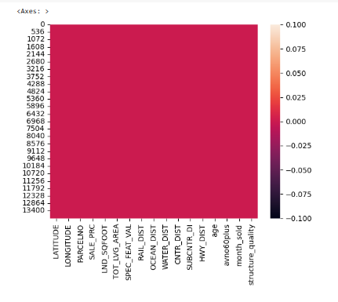
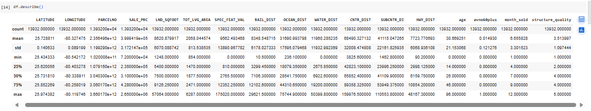

# Laporan Proyek Machine Learning
### Nama : Winda Ayu Melati
### Nim : 211351150
### Kelas : Teknik Informatika - Pagi A

## Domain Proyek
Proyek ini dilakukan untuk melakukan analisis harga historis 30 komoditas yang berbeda selama periode tahun 1960 hingga 2021. Fokus utamanya adalah mengidentifikasi hubungan antara tahun dan harga komoditas dalam konteks ekonomi global. Proyek ini mencakup estimasi tahun berdasarkan perilaku harga komoditas.

## Business Understanding
Proyek analisis tahun berdasarkan harga komoditas seperti Cocoa, Kopi, Teh, Beras, Daging Sapi, Gula, Minyak Kelapa, dan Emas dari tahun 1960 hingga 2021 bertujuan untuk memberikan pemahaman mengenai bagaimana harga komoditas berubah selama periode waktu yang panjang dan bagaimana perubahan harga ini bisa mempengaruhi ekonomi global.

Bagian laporan ini mencakup:

### Problem Statements
Bagaimana estimasi tahun berdasarkan perilaku harga komoditas dapat membantu dalam meramalkan tren masa depan dalam industri-industri terkait komoditas?

### Goals
Tujuan proyek ini adalah membangun model peramalan tren masa depan dalam industri-industri terkait komoditas dengan menggunakan estimasi tahun berdasarkan perilaku harga komoditas.

### Solution statements
1.	Solusi pertama adalah mengembangkan model peramalan tahun berdasarkan harga komoditas berbasis machine learning yang akan memanfaatkan data dari Kaggle.com mengenai historis harga komoditas dari tahun 1960 hingga 2021. Model ini akan digunakan untuk meramalkan tahun untuk harga komoditas di masa depan.
2.	Model yang dihasilkan dari dataset akan menggunakan metode Regresi Linear untuk melakukan peramalan tahun berdasarkan harga komoditas.

## Data Understanding
Data yang saya gunakan dalam proyek ini di dapatkan dari Kaggle.com mengenai dataset harga historis 30 komoditas berbeda dari tahun 1960 hingga 2021 dan bisa diakses di link berikut [Commodity Prices]

https://www.kaggle.com/datasets/elmoallistair/commodity-prices-19602021

Variabel-variabel pada Commodity Prices adalah sebagai berikut:
- **Year (Tipe data: int64)**: Menunjukkan tahun di mana harga komoditas tersebut dicatat atau diamati.
- **Cocoa (\$/kg) (Tipe data: float64)**: Harga harian yang diambil dari International Cocoa Organization (ICCO), yang merupakan rata-rata dari tiga posisi pertama di pasar berjangka di New York dan London untuk tiga bulan perdagangan masa depan terdekat.
- **Coffee (\$/kg) (Tipe data: float64)**: Harga indikator dari International Coffee Organization (ICO) untuk kopi mild Arabika lainnya, yang diambil dari rata-rata pasar di New York dan Bremen/Hamburg, termasuk biaya pengiriman.
- **Tea (\$/kg) (Tipe data: float64)**: Harga teh dihitung sebagai rata-rata dari tiga lelang terbesar, yang merupakan rata-rata aritmetika dari penawaran harga di pasar lelang di Kolkata, Colombo, dan Mombasa/Nairobi.
- **Rice (\$/kg) (Tipe data: float64)**: Harga beras Thailand, 5% pecah, beras putih (White Rice), yang telah digiling, merupakan harga indikatif yang didasarkan pada survei mingguan atas transaksi ekspor, sesuai dengan standar pemerintah, f.o.b. Bangkok.
- **Sugar (\$/mt) (Tipe data: float64)**: Harga Harian Gula Internasional (International Sugar Agreement - ISA), gula mentah, f.o.b. (free on board) yang disimpan di pelabuhan-pelabuhan besar di wilayah Karibia.
- **Beef (\$/mt) (Tipe data: float64)**: Harga daging sapi dari Australia/Selandia Baru, dengan campuran 85%, dikirim ke pelabuhan masuk Pantai Timur, dengan pengiriman ditangguhkan 7-45 hari, telah dicatat sejak Januari 1995.
- **Gold (\$/kg) (Tipe data: float64)**: Harga Emas Inggris, dengan tingkat kemurnian 99.5%, dihitung berdasarkan harga rata-rata harian yang ditentukan pada akhir sesi perdagangan harian di London.
- **Coconut Oil (\$/kg) (Tipe data: float64)**: Harga minyak kelapa berasal dari Filipina dan Indonesia. Data ini mencakup periode waktu tertentu, yaitu dari Januari 2021 ke depan, di mana minyak kelapa bersifat kasar (belum diolah) dan disertakan biaya pengiriman CIF ke Rotterdam. Selain itu, data juga mencakup periode dari Januari 1999 hingga Desember 2020, di mana minyak kelapa juga bersifat kasar dan disertakan biaya pengiriman CIF ke wilayah NW (Northwest) Europe.

## Data Preparation
### Data Collection
Untuk data collection ini, saya menggunakan dataset yang didapatkan dari website Kaggle mengenai harga historis 30 komoditas yang berbeda selama periode tahun 1960 hingga 2021 (Commodity Prices).

## Data Discovery And Profiling
Disini saya menggunakan Teknik EDA (Exploratory Data Analysis).

Langkah pertama kita harus menghubungkan google colab dengan kaggle. kita harus mengimportkan dan mengupload sebuah file yang merupakan token Kaggle agar bisa terhubung dengan kaggle dan agar bisa mendownload sebuah dataset dari kaggle melalui google colab menggunakan script:

```python
from google.colab import files
files.upload()
```

Langkah selanjutnya yaitu membuat folder untuk menyimpan file kaggle.json yang sudah di upload tadi dan memberikan izin (permission) dengan menggunakan script:

```python
!mkdir -p ~/.kaggle
!cp kaggle.json ~/.kaggle/
!chmod 600 ~/.kaggle/kaggle.json
!ls ~/.kaggle
```
Langkah selanjutnya memanggil url dataset yang ada di website kaggle untuk didownload langsung ke google colab dengan menggunakan script:

```python
!kaggle datasets download -d elmoallistair/commodity-prices-19602021
```
Selanjutnya kita ekstrak dataset yang sudah didownload menggunakan
script:

```python
!mkdir commodity-prices-19602021
!unzip commodity-prices-19602021
!ls commodity-prices-19602021
```
Langkah selanjutnya kita harus mengimport library yang digunakan/dibutuhkan pada studi kasus ini : 

```python
import pandas as pd
import numpy as np
import matplotlib.pyplot as plt
import seaborn as sns
from sklearn.model_selection import train_test_split
from sklearn.linear_model import LinearRegression
```

Langkah selanjutnya memanggil dataset menggunakan perintah :
```python
df = pd.read_csv('commodity_prices.csv')
```
Selanjutnya mengdeskripsikan 5 data paling atas dari dataset menggunakan perintah :

```python
df.head()
```


Karena didalam data terdapat beberapa kolom yang tidak akan digunakan, maka data tersebut akan didrop kolom tersebut menggunakan perintah :

```python
df = df.drop(['Crude Oil', 'Coal', 'Natural Gas', 'Banana','Orange', 'Barley', 'Maize', 'Sorghum', 'Wheat', 'Chicken', 'Lamb', 'Shrimps','Platinum', 'Silver', 'Cotton', 'Rubber', 'Tobacco', 'Groundnut Oil', 'Palm Oil', 'Soybean', 'Logs', 'Sawnwood'], axis=1)
```
Setelah mendrop kolom yang tidak akan digunakan kita tampilkan lagi 5 data atas dari dataset menggunakan :

```python
df.head()
```


Selanjutnya yaitu melihat tipe data dari masing-masing atribut/fitur dari dataset commodity_prices.csv menggunakan perintah property info :

```python
df.info()
```


 
Selanjutnya memeriksa apakah datasetnya terdapat baris yang kosong atau null dengan menggunakan seaborn dengan perintah :

```python
sns.heatmap(df.isnull())
```


Selanjutnya mengecek detail informasi dari dataset commodity_prices.csv menggunakan perintah :

```python
df.describe()
```

 

Selanjutnya kita gambarkan menggunakan visualisasi heatmap untuk melihat sebarand data pada dataset commodity_prices.csv ini menggunakan perintah :

```python
plt.figure(figsize=(10,8))
sns.heatmap(df.corr(),annot=True)

```


Selanjutnya kita coba menampilkan Harga Kopi berdasarkan Tahun menggunakan script berikut :

```python
models = df.groupby('Coffee').count()'Year'.sort_values(by='Year',ascending=True).reset_index()
models = models.rename(columns={'Year':'NoOfProduct'})
```

```python
fig = plt.figure(figsize=(15,5))
sns.barplot(x=models['Coffee'], y=models['NoOfProduct'], color='royalblue')
plt.xticks(rotation=60)
 ```
  

Selanjutnya kita coba menampilkan informasi mengenai harga Teh pada dataset ini menggunakan perintah :

```python
Tea = df.groupby('Tea').count()'Year'.sort_values(by='Year',ascending=True).reset_index()
Tea = Tea.rename(columns={'Year':'count'})
```

```python
plt.figure(figsize=(15,5))
sns.barplot(x=Tea['Tea'], y=Tea['count'], color='royalblue')
```


Selanjutnya kita tampilkan hasil dari distribusi data harga Kopi menggunakan perintah :

```python
plt.figure(figsize=(15,5))
sns.distplot(df['Coffee'])
```


 
Dan kita tampilkan juga hasil dari distribusi data harga Teh menggunakan perintah :

```python
plt.figure(figsize=(15,5))
sns.distplot(df['Tea'])
```


 
Proses data exploration dan cleansing telah selesai dilakukan, dan selanjutnya akan dilanjutkan dengan proses pemodelan data (Modeling).

## Modeling
Setelah melakukan tahap analisis data kita lanjut pada tahap modelling.

Library yang saya gunakan yaitu :
```python
from sklearn.model_selection import train_test_split
from sklearn.linear_model import LinearRegression
```

Karena saya sudah mengimportkan library di data preparation diatas kita tidak perlu mengimportkan kembali library.

Langkah selanjutnya yaitu melakukan seleksi fitur dengan memisahkan mana saja atribut yang akan dijadikan sebagai fitur dan atribut mana saja yang akan dijadikan label seperti berikut :

```python
features = ['Cocoa', 'Coffee', 'Tea', 'Rice', 'Beef', 'Sugar', 'Coconut Oil','Gold']
x = df[features]
y= df['Year']
print("Shape of x:", x.shape)
print("Shape of y:", y.shape)
```


 
Selanjutnya yaitu melakukan split data, yaitu memisahkan data training dan data testing dengan script seperti berikut :

```python
x_train, x_test, y_train, y_test = train_test_split(x,y,random_state=70)
y_test.shape
```


Tahap selanjutnya yaitu membuat Model Regresi Linear dan memasukan data training dan testing ke dalam model Regresi Linear :

```python
lr = LinearRegression()
lr.fit(x_train, y_train)
pred = lr.predict(x_test)
```

Selanjutnya menampilkan akurasi estimasi dengan menggunakan script berikut:

```python
score = lr.score(x_test, y_test)
print('akurasi model linear =', score)
```


Selanjutnya membuat Inputan Model Regresi Linear menggunakan script seperti berikut:

```python
#Cocoa = 1.27, Coffee = 1.97, Tea = 2,06, Rice = 107.35, Beef = 0.74, Sugar = 0.07, Coconut Oil = 312.33, Gold = 35.27
input_data = np.array(1.27, 1.97, 2.06, 107.35, 0.74, 0.07, 312.33, 35.27)
prediction = lr.predict(input_data)
print('Estimasi Tahun:', int(prediction[0]))
```

Jika sudah berhasil semua jangan lupa untuk menyimpan model menggunakan pickle seperti berikut:

```python
import pickle
filename ='commodity_prices.sav'
pickle.dump(lr, open(filename, 'wb'))
```


Proses Modeling selesai.

## Evaluation
Disini saya menggunakan metrik evaluasi R-squared (R²) atau koefisien determinasi.

R-squared (R²) adalah metrik evaluasi dalam analisis regresi yang mengukur tingkat kesesuaian model regresi dengan data aktual. Rentang nilai R² adalah dari 0 (model tidak sesuai sama sekali) hingga 1 (model sesuai sempurna dengan data). R² mengukur seberapa baik model mampu menjelaskan variasi dalam variabel dependen (dalam hal ini, tahun sebagai variabel respons) berdasarkan variabel independen (dalam hal ini, perilaku harga komoditas sebagai variabel prediktor). Semakin tinggi nilai R², semakin baik model dalam menjelaskan variasi dalam data, menunjukkan penjelasan yang lebih baik oleh model.

Rumus R-squared (R²) adalah sebagai berikut:

\[ R^2 = 1 - \frac{SSR}{SST} \]

Di mana:
- \( R^2 \): Koefisien determinasi (R-squared).
- \( SSR \): Jumlah kuadrat sisa (Sum of Squares Residual), yaitu jumlah kuadrat perbedaan antara nilai-nilai yang diprediksi oleh model dan nilai-nilai yang diamati dalam data.
- \( SST \): Jumlah kuadrat total (Sum of Squares Total), yaitu jumlah kuadrat perbedaan antara nilai-nilai dalam data dan nilai rata-rata data.

Setelah itu, saya menerapkannya dalam kode program dengan menggunakan metrik R-squared (R²) seperti berikut :

```python
from sklearn.metrics import r2_score

# Data fitur (harga komoditas) dan tahun
features = ['Cocoa', 'Coffee', 'Tea', 'Rice', 'Beef', 'Sugar', 'Coconut Oil','Gold']
X = df[features]
y = df['Year']

# Membuat model regresi linear
model = LinearRegression()
model.fit(X, y)

# Melakukan prediksi tahun berdasarkan harga komoditas
predicted_years = model.predict(X)

# Menghitung R-squared (R²)
r_squared = r2_score(y, predicted_years)

# Menampilkan hasil
print("R-squared (R²):", r_squared)
```


Hasil yang saya dapatkan dari R-squared sebesar 0.8375032561246034 atau sekitar 84% menunjukan bahwa model regresi cocok dengan data aktual dalam konteks estimasi tahun berdasarkan perilaku harga komoditas. Hal ini menunjukkan bahwa semakin tinggi nilai R-squared, semakin baik model dalam menjelaskan hubungan antara tahun dan perilaku harga komoditas.

## Deployment

