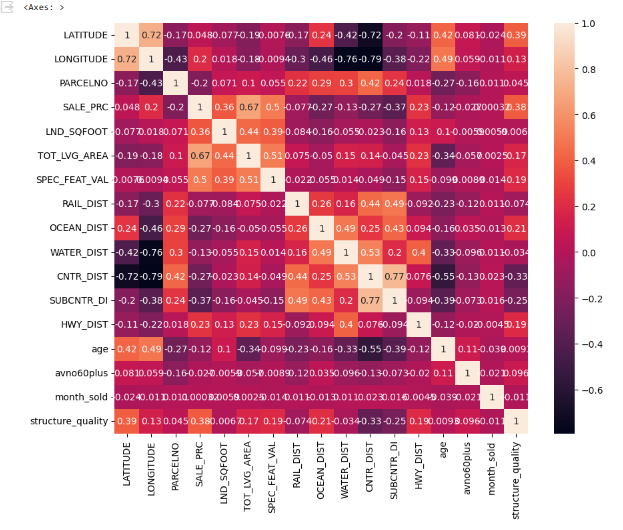
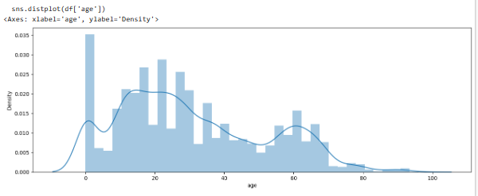
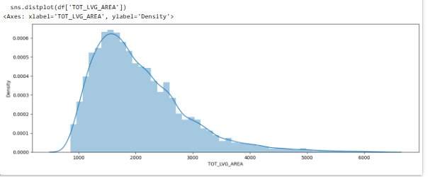

# Laporan Proyek Machine Learning
### Nama : Winda Ayu Melati
### Nim : 211351150
### Kelas : Teknik Informatika - Pagi A

## Domain Proyek
## Domain Proyek
Proyek ini melibatkan analisis harga historis properti perumahan di wilayah Miami, Florida, selama periode waktu yang ditentukan. Fokus utamanya adalah mengidentifikasi faktor-faktor yang memengaruhi harga rumah di Miami dan membangun model estimasi harga rumah berdasarkan perilaku pasar properti di wilayah ini. Selama analisis ini, data properti Miami akan dieksplorasi untuk memahami hubungan antara berbagai fitur, seperti lokasi geografis, ukuran tanah, luas lantai, dan faktor-faktor lain, dengan harga jual properti perumahan.

## Business Understanding
Proyek analisis harga pasar properti perumahan di wilayah Miami, Florida untuk memberikan pemahaman mendalam tentang dinamika pasar properti di Miami. Ini mencakup pemahaman mengenai bagaimana faktor-faktor seperti lokasi, perkembangan ekonomi, perubahan infrastruktur, dan faktor-faktor lainnya memengaruhi harga rumah. 

Bagian laporan ini mencakup:

### Problem Statements
- Bagaimana faktor-faktor kondisi ekonomi, dan perkembangan infrastruktur memengaruhi harga rumah di wilayah Miami, Florida, selama periode waktu tertentu, dan bagaimana perubahan ini dapat mempengaruhi pasar properti lokal.
- Bagaimana kita dapat membangun model estimasi harga rumah yang dapat memberikan perkiraan harga yang akurat berdasarkan perilaku pasar properti di Miami.

### Goals
- Menganalisis data harga pasar properti perumahan di wilayah Miami, Florida, selama periode waktu yang ditentukan untuk mengidentifikasi faktor-faktor yang memengaruhi harga rumah.
- Mengembangkan model estimasi harga rumah yang dapat memberikan perkiraan harga rumah yang akurat berdasarkan analisis data historis dan faktor-faktor yang mempengaruhi harga properti di Miami.
- Membantu pemangku kepentingan, termasuk pembeli, penjual, dan investor, dalam membuat keputusan yang lebih informasi dalam pembelian, penjualan, atau investasi properti di wilayah Miami.

### Solution statements
Tentu, berikut solusi dalam format yang lebih singkat dan mudah dimengerti:

### Solusi
1. Analisis data harga rumah di Miami untuk memahami faktor-faktor pengaruhnya, seperti lokasi, ukuran, dan kondisi properti.
2. Membangun model peramalan harga rumah berdasarkan data historis dan faktor-faktor yang telah diidentifikasi.
3. Model yang dihasilkan dari dataset akan menggunakan metode Regresi Linear untuk melakukan peramalan tahun berdasarkan harga komoditas.

## Data Understanding
Data yang saya gunakan dalam proyek ini di dapatkan dari Kaggle.com mengenai dataset Memprediksi harga Miami Houses.Dan bisa diakses di link berikut :

https://www.kaggle.com/datasets/deepcontractor/miami-housing-dataset

Variabel-variabel pada Miami Housing Dataset adalah sebagai berikut:

- **structure_quality (Tipe data: int64)**: Merupakan penilaian kualitas struktur atau bangunan properti. 

- **LATITUDE (Tipe data: float64)**: Merupakan nilai lintang geografis lokasi properti. 

- **LONGITUDE (Tipe data: float64)**: Merupakan nilai bujur geografis lokasi properti. 
- **PARCELNO (Tipe data: int64)**: Merupakan identifikasi unik untuk setiap properti. 
- **SALE_PRC (Tipe data: float64)**: Menunjukkan harga penjualan properti dalam dolar. 
- **LND_SQFOOT (Tipe data: int64)**: Menunjukkan luas tanah dalam kaki persegi. 

- **TOT_LVG_AREA (Tipe data: int64)**: Merupakan luas lantai properti dalam kaki persegi. 

- **SPEC_FEAT_VAL (Tipe data: int64)**: Menunjukkan nilai fitur khusus pada properti (misalnya, kolam renang) dalam dolar. 

- **RAIL_DIST (Tipe data: float64)**: Menunjukkan jarak properti ke jalur kereta api terdekat (indikator kebisingan) dalam kaki. 

- **OCEAN_DIST (Tipe data: float64)**: Menunjukkan jarak properti ke lautan terdekat dalam kaki. 

- **WATER_DIST (Tipe data: float64)**: Menunjukkan jarak properti ke badan air (seperti sungai atau danau) terdekat dalam kaki. 

- **CNTR_DIST (Tipe data: float64)**: Menunjukkan jarak properti ke distrik bisnis pusat Miami dalam kaki. 

- **SUBCNTR_DI (Tipe data: float64)**: Menunjukkan jarak properti ke subpusat terdekat dalam kaki. 

- **HWY_DIST (Tipe data: float64)**: Menunjukkan jarak properti ke jalan raya terdekat (indikator kebisingan) dalam kaki. 

- **age (Tipe data: int64)**: Merupakan usia bangunan atau struktur properti. 

- **avno60plus (Tipe data: int64)**: Variabel dummy yang menunjukkan apakah properti terkena kebisingan pesawat melebihi tingkat yang dapat diterima. 

- **month_sold (Tipe data: int64)**: Menunjukkan bulan penjualan properti pada tahun 2016 (dalam bentuk angka, misalnya, 1 untuk Januari). 

## Data Preparation
### Data Collection
Untuk data collection ini, saya menggunakan dataset yang didapatkan dari website Kaggle mengenai Memprediksi harga Miami Houses.(Miami Housing Dataset).


## Data Discovery And Profiling
Disini saya menggunakan Teknik EDA (Exploratory Data Analysis).

Langkah pertama kita harus menghubungkan google colab dengan kaggle. kita harus mengimportkan dan mengupload sebuah file yang merupakan token Kaggle agar bisa terhubung dengan kaggle dan agar bisa mendownload sebuah dataset dari kaggle melalui google colab menggunakan script:

```python
from google.colab import files
files.upload()
```

Langkah selanjutnya yaitu membuat folder untuk menyimpan file kaggle.json yang sudah di upload tadi dan memberikan izin (permission) dengan menggunakan script:

```python
!mkdir -p ~/.kaggle
!cp kaggle.json ~/.kaggle/
!chmod 600 ~/.kaggle/kaggle.json
!ls ~/.kaggle
```
Langkah selanjutnya memanggil url dataset yang ada di website kaggle untuk didownload langsung ke google colab dengan menggunakan script:

```python
!kaggle datasets download -d deepcontractor/miami-housing-dataset
```
Selanjutnya kita ekstrak dataset yang sudah didownload menggunakan
script:
```python
!mkdir toronto-home-price-index
!unzip miami-housing-dataset.zip -d miami
!ls miami
```
Langkah selanjutnya kita harus mengimport library yang digunakan/dibutuhkan pada studi kasus ini : 

```python
import pandas as pd
import numpy as np
import matplotlib.pyplot as plt
import seaborn as sns
```

Langkah selanjutnya memanggil dataset menggunakan perintah :
```python
df = pd.read_csv("/content/miami/miami-housing.csv")
```

Selanjutnya mengdeskripsikan 5 data paling atas dari dataset menggunakan perintah :

```python
df.head()
```


Selanjutnya yaitu melihat tipe data dari masing-masing atribut/fitur dari dataset miami-housing.csv menggunakan perintah property info :

```python
df.info()
```


Selanjutnya memeriksa apakah datasetnya terdapat baris yang kosong atau null dengan menggunakan seaborn dengan perintah :

```python
sns.heatmap(df.isnull())
```


Selanjutnya mengecek detail informasi dari dataset miami-housing menggunakan perintah :

```python
df.describe()
```


Selanjutnya kita gambarkan menggunakan visualisasi heatmap untuk melihat sebarand data pada dataset ini menggunakan perintah :

```python
plt.figure(figsize=(10,8))
sns.heatmap(df.corr(),annot=True)
```


Selanjutnya kita coba menampilkan Harga Rumah Berdasarkan Umur Rumah menggunakan script berikut :
```python
 age = df.groupby('age').count()[['SALE_PRC']].sort_values(by='SALE_PRC',ascending=True).reset_index()
 age = age.rename(columns={'SALE_PRC':'SALE_PRC'})
```

```python
fig = plt.figure(figsize=(15,5))
sns.barplot(x= age['age'], y= age['SALE_PRC'], color='royalblue')
plt.xticks(rotation=60)
```


Selanjutnya kita coba menampilkan Harga Rumah berdasarkan Living Areamenggunakan script berikut :
```python
area = df.groupby('TOT_LVG_AREA').count()[['SALE_PRC']].sort_values(by='SALE_PRC',ascending=True).reset_index()
area = area.rename(columns={'SALE_PRC':'count'})
```


```python
plt.figure(figsize=(15,5))
sns.barplot(x=area['TOT_LVG_AREA'], y=area['count'], color='royalblue')
```


Selanjutnya kita tampilkan distribusi dari HArga rumah dari Umur Rumah:

```python
plt.figure(figsize=(15,5))
sns.distplot(df['age'])
```


Selanjutnya kita tampilkan distribusi Harga Rumah berdasarkan Living Area:

```python
plt.figure(figsize=(15,5))
sns.distplot(df['TOT_LVG_AREA'])
```


Proses data exploration dan cleansing telah selesai dilakukan, dan selanjutnya akan dilanjutkan dengan proses pemodelan data (Modeling).

## Modeling
Setelah melakukan tahap analisis data kita lanjut pada tahap modelling.

Library yang saya gunakan yaitu :
```python
from sklearn.model_selection import train_test_split
from sklearn.linear_model import LinearRegression
```
Langkah selanjutnya yaitu melakukan seleksi fitur dengan memisahkan mana saja atribut yang akan dijadikan sebagai fitur dan atribut mana saja yang akan dijadikan label seperti berikut :


```python
features = ['LATITUDE', 'LONGITUDE', 'PARCELNO', 'LND_SQFOOT', 'TOT_LVG_AREA', 'SPEC_FEAT_VAL', 'RAIL_DIST', 'OCEAN_DIST','WATER_DIST', 'CNTR_DIST', 'SUBCNTR_DI','HWY_DIST', 'age', 'avno60plus', 'month_sold', 'structure_quality']
x = df[features]
y = df['SALE_PRC']
x.shape, y.shape
```


Selanjutnya yaitu melakukan split data, yaitu memisahkan data training dan data testing dengan script seperti berikut :

```python
x_train, x_test, y_train, y_test = train_test_split(x, y,test_size=0.5, random_state=34)
y_test.shape
x_train.shape
```


Tahap selanjutnya yaitu membuat Model Regresi Linear dan memasukan data training dan testing ke dalam model Regresi Linear :

```python
lr = LinearRegression()
lr.fit(x_train,y_train)
pred = lr.predict(x_test)
```
Selanjutnya menampilkan akurasi estimasi dengan menggunakan script berikut:

```python
score = lr.score(x_test,y_test)
print('Akurasi model Regresi Linear', score)
```


Selanjutnya membuat Inputan Model Regresi Linear menggunakan script seperti berikut:
```python
#input_data = np.array([[25.891031,-80.160561,622280070620,9375,1753,0,2815.9,12811.4,347.6,42815.3,37742.2,15954.9,67,0,8,4]])

prediction = lr.predict(input_data)
print('Estimasi Harga House Miami :',prediction)
```


Jika sudah berhasil melakukan semua tahapan jangan lupa untuk menyimpan model menggunakan pickle seperti berikut:

```python
import pickle

filename = 'Miami.sav'
pickle.dump(lr,open(filename,'wb'))
```
Proses Modeling selesai.

## Evaluation
Disini saya menggunakan metrik evaluasi R-squared (R²) atau koefisien determinasi.

R-squared (R²) adalah metrik evaluasi dalam analisis regresi yang mengukur tingkat kesesuaian model regresi dengan data aktual. Rentang nilai R² adalah dari 0 (model tidak sesuai sama sekali) hingga 1 (model sesuai sempurna dengan data). R² mengukur seberapa baik model mampu menjelaskan variasi dalam variabel dependen (dalam hal ini, tahun sebagai variabel respons) berdasarkan variabel independen (dalam hal ini, perilaku harga komoditas sebagai variabel prediktor). Semakin tinggi nilai R², semakin baik model dalam menjelaskan variasi dalam data, menunjukkan penjelasan yang lebih baik oleh model.

Rumus R-squared (R²) adalah sebagai berikut:
R² = 1 - (SSR / SST)

Di mana:
- R² : Koefisien determinasi (R-squared).
- SSR : Jumlah kuadrat sisa (Sum of Squares Residual), yaitu jumlah kuadrat perbedaan antara nilai-nilai yang diprediksi oleh model dan nilai-nilai yang diamati dalam data.
- SST : Jumlah kuadrat total (Sum of Squares Total), yaitu jumlah kuadrat perbedaan antara nilai-nilai dalam data dan nilai rata-rata data.


Saya menerapkannya dalam kode program dengan menggunakan metrik R-squared (R²) seperti berikut :
```python
from sklearn.metrics import r2_score
from sklearn.linear_model import LinearRegression

# Data fitur untuk memprediksi harga rumah di Miami
features = ['LATITUDE', 'LONGITUDE', 'PARCELNO', 'LND_SQFOOT', 'TOT_LVG_AREA', 'SPEC_FEAT_VAL', 'RAIL_DIST', 'OCEAN_DIST','WATER_DIST', 'CNTR_DIST', 'SUBCNTR_DI','HWY_DIST', 'age', 'avno60plus', 'month_sold', 'structure_quality']
X = df[features]
y = df['SALE_PRC']

# Membuat model regresi linear
model = LinearRegression()
model.fit(X, y)

# Melakukan prediksi harga rumah
predicted_prices = model.predict(X)

# Menghitung R-squared (R²) untuk evaluasi model
r_squared = r2_score(y, predicted_prices)

# Menampilkan hasil
print("R-squared (R²) untuk prediksi harga rumah di Miami:", r_squared)
```


Hasil yang saya dapatkan dari R-squared sebesar 0.7138484272045863 atau sekitar 71% menunjukkan bahwa model regresi cocok dengan data aktual dalam memprediksi harga rumah di Miami berdasarkan fitur-fitur yang diberikan. Hal ini menunjukkan bahwa semakin tinggi nilai R-squared, semakin baik model dalam menjelaskan hubungan antara fitur-fitur dan harga rumah. Dengan R-squared sekitar 71%, model ini memiliki tingkat kecocokan yang baik dalam menjelaskan variasi harga rumah di Miami.

## Deployment
https://miami-housing-prices.streamlit.app/

